# Machine Learning Comprehensive Guide

A complete reference guide covering fundamental concepts, algorithms, and techniques in Machine Learning, Deep Learning, and Data Science.

---

## Table of Contents

- [Foundational Concepts](#foundational-concepts)
  - [AI vs ML vs DL vs Data Science](#ai-vs-ml-vs-dl-vs-data-science)
  - [Types of Machine Learning](#types-of-machine-learning)
- [Supervised Learning](#supervised-learning)
  - [Regression vs Classification](#regression-vs-classification)
  - [Linear Regression](#linear-regression)
  - [Performance Metrics](#performance-metrics)
  - [Regularization Techniques](#regularization-techniques)
  - [Bias and Variance](#bias-and-variance)
  - [Logistic Regression](#logistic-regression)
  - [Classification Metrics](#classification-metrics)
  - [Naïve Bayes](#naïve-bayes)
  - [K-Nearest Neighbors (KNN)](#k-nearest-neighbors-knn)
  - [Decision Trees](#decision-trees)
  - [Ensemble Techniques](#ensemble-techniques)
  - [Support Vector Machine (SVM)](#support-vector-machine-svm)
- [Unsupervised Learning](#unsupervised-learning)
  - [K-Means Clustering](#k-means-clustering)
  - [Hierarchical Clustering](#hierarchical-clustering)
  - [DBScan Clustering](#dbscan-clustering)
  - [Clustering Validation](#clustering-validation)

---

## Foundational Concepts

### AI vs ML vs DL vs Data Science


| Concept | Definition | Examples/Goal |
|---------|------------|---------------|
| **Artificial Intelligence (AI)** | The entire universe of creating applications that perform tasks without human intervention. ML, DL, and Data Science all contribute to AI applications. | Netflix recommendations, Amazon product suggestions, Tesla self-driving cars |
| **Machine Learning (ML)** | A **subset of AI** that provides statistical tools to analyze data, visualize patterns, and perform predictions or forecasting. | Statistical analysis, predictive modeling |
| **Deep Learning (DL)** | A **subset of ML** that mimics the human brain using **multi-layered neural networks** to solve complex problems. | Image recognition, natural language processing |
| **Data Science** | Encompasses ML and DL projects, plus data analysis and visualization (e.g., Tableau, Power BI). | End-to-end data solutions, business intelligence |

### Types of Machine Learning


The majority of business use cases fall into **Supervised** and **Unsupervised** learning.

| Type | Characteristics | Problem Types |
|------|----------------|---------------|
| **Supervised ML** | Datasets include **dependent features** (outputs) and **independent features** (inputs). The goal is to predict the dependent variable based on independent variables. | Regression, Classification |
| **Unsupervised ML** | Datasets have **no output variable**. Focus is on finding patterns, structure, or groupings within the data. | Clustering, Dimensionality Reduction |
| **Reinforcement Learning** | Learning through interaction with an environment using rewards and penalties. | Game AI, robotics |

---

## Supervised Learning

### Regression vs Classification

```mermaid
graph TB
    Problem["Supervised Learning Problem"]
    
    Problem --> CheckOutput{"Output Type?"}
    
    CheckOutput -->|Continuous| Regression["Regression Problem<br/>Predict numerical values"]
    CheckOutput -->|Categorical| Classification["Classification Problem<br/>Predict categories"]
    
    Regression --> RegEx["Examples:<br/>• House prices<br/>• Stock prices<br/>• Temperature<br/>• Sales forecast"]
    
    Classification --> ClassEx["Examples:<br/>• Spam detection<br/>• Disease diagnosis<br/>• Image recognition<br/>• Customer churn"]
    
    style Problem fill:#667eea,stroke:#764ba2,color:#fff
    style Regression fill:#f093fb,stroke:#f5576c,color:#fff
    style Classification fill:#4facfe,stroke:#00f2fe,color:#fff
```

| Problem Type | Output Type | Goal | Example |
|--------------|-------------|------|---------|
| **Regression** | Continuous variable | Predict a numerical value | House price prediction, weight estimation |
| **Classification** | Categorical variable | Categorize input into fixed classes | Pass/Fail, Spam/Not Spam |

### Linear Regression

Linear regression finds the **best fit line** to predict continuous outputs.

```mermaid
graph TB
    Start["Linear Regression Process"]
    
    Start --> Hypothesis["1. Hypothesis Function<br/>H_θ(x) = θ₀ + θ₁ × X"]
    Hypothesis --> Cost["2. Cost Function<br/>J(θ₀, θ₁) = (1/2m) × Σ(H_θ(Xᵢ) - Yᵢ)²"]
    Cost --> GD["3. Gradient Descent<br/>θⱼ := θⱼ - α × ∂J/∂θⱼ"]
    GD --> Check{"Converged?"}
    Check -->|No| GD
    Check -->|Yes| Final["Optimal Parameters<br/>Best Fit Line"]
    
    style Start fill:#667eea,stroke:#764ba2,color:#fff
    style Hypothesis fill:#f093fb,stroke:#f5576c,color:#fff
    style Cost fill:#feca57,stroke:#ff9ff3,color:#000
    style GD fill:#48dbfb,stroke:#0abde3,color:#000
    style Final fill:#1dd1a1,stroke:#10ac84,color:#fff
```

#### Key Components

**Hypothesis Function:**
```
H_θ(x) = θ₀ + θ₁ × X
```
- `θ₀` (Intercept): Y-axis intersection point when X = 0
- `θ₁` (Slope): Rate of change in Y for unit change in X

**Cost Function (Squared Error):**
```
J(θ₀, θ₁) = (1/2m) × Σ(H_θ(Xᵢ) - Yᵢ)²
```
- Measures the difference between predicted and actual values
- Goal: **Minimize** this function

**Gradient Descent:**
```
θⱼ := θⱼ - α × ∂J(θ₀, θ₁)/∂θⱼ
```
- Convergence algorithm to find optimal parameters
- `α` (Learning Rate): Controls the speed of convergence
- Too large → overshooting; too small → slow training

> [!NOTE]
> Linear regression with squared error produces a **convex function** (parabola), avoiding local minima issues.

#### Example: House Price Prediction

**Problem:** Predict house prices based on square footage.

**Dataset:**
```python
# Features (X): Square Footage
# Target (Y): Price in $1000s
X = [1000, 1500, 2000, 2500, 3000]
Y = [200, 300, 400, 500, 600]
```

**Solution:**
```python
from sklearn.linear_model import LinearRegression
import numpy as np

# Reshape data
X = np.array(X).reshape(-1, 1)
Y = np.array(Y)

# Create and train model
model = LinearRegression()
model.fit(X, Y)

# Get parameters
print(f"Intercept (θ₀): {model.intercept_}")
print(f"Slope (θ₁): {model.coef_[0]}")

# Predict for 2200 sq ft house
prediction = model.predict([[2200]])
print(f"Predicted price: ${prediction[0]}k")
```

**Output:**
- Intercept (θ₀): 0
- Slope (θ₁): 0.2
- Predicted price: $440k

**Real-World Applications:**
- 🏠 Real estate price prediction
- 📈 Stock price forecasting
- 🌡️ Temperature prediction
- 💰 Sales forecasting
- ⚡ Energy consumption estimation

### Performance Metrics

```mermaid
graph LR
    Metrics["Regression Metrics"]
    
    Metrics --> R2["R-squared (R²)<br/>Goodness of fit"]
    Metrics --> AdjR2["Adjusted R²<br/>Penalized R²"]
    
    R2 --> R2Prob["Problem: Increases with<br/>irrelevant features"]
    AdjR2 --> AdjSol["Solution: Penalizes<br/>extra features"]
    
    R2Prob -.->|Fixed by| AdjR2
    
    style Metrics fill:#667eea,stroke:#764ba2,color:#fff
    style R2 fill:#feca57,stroke:#ff9ff3,color:#000
    style AdjR2 fill:#1dd1a1,stroke:#10ac84,color:#fff
```

#### R-squared (R²)

Measures the goodness of fit:
```
R² = 1 - (Sum of Residuals / Sum of Total)
R² = 1 - Σ(Yᵢ - Ŷᵢ)² / Σ(Yᵢ - Ȳ)²
```
- Range: 0 to 1 (higher is better)
- **Drawback:** Increases even with irrelevant features

#### Adjusted R-squared

Penalizes R² based on the number of features:
- Prevents selection of models with irrelevant features
- Decreases when non-correlated features are added
- Always **lower** than R²

### Regularization Techniques

```mermaid
graph TB
    Problem["Overfitting Problem<br/>High Variance"]
    
    Problem --> Reg["Regularization Techniques"]
    
    Reg --> Ridge["Ridge Regression (L2)<br/>Penalty: λ × (Slope)²"]
    Reg --> Lasso["Lasso Regression (L1)<br/>Penalty: λ × |Slope|"]
    
    Ridge --> RidgeEffect["Effect:<br/>• Reduces slope values<br/>• Keeps all features<br/>• Prevents overfitting"]
    
    Lasso --> LassoEffect["Effect:<br/>• Sets coefficients to ~0<br/>• Feature selection<br/>• Prevents overfitting"]
    
    style Problem fill:#ee5a6f,stroke:#c92a2a,color:#fff
    style Reg fill:#667eea,stroke:#764ba2,color:#fff
    style Ridge fill:#f093fb,stroke:#f5576c,color:#fff
    style Lasso fill:#4facfe,stroke:#00f2fe,color:#fff
```

| Technique | Type | Penalty Added | Purpose | Effect |
|-----------|------|---------------|---------|--------|
| **Ridge Regression** | L2 | `λ × (Slope)²` | Prevent overfitting | Minimizes slope values |
| **Lasso Regression** | L1 | `λ × |Slope|` | Prevent overfitting + Feature selection | Sets unimportant coefficients to near zero |

- `λ` (Lambda): Regularization hyperparameter tuned via cross-validation

#### Example: Preventing Overfitting in Salary Prediction

**Problem:** Predict salary based on years of experience, but model overfits with too many polynomial features.

**Ridge Regression Example:**
```python
from sklearn.linear_model import Ridge
from sklearn.preprocessing import PolynomialFeatures
import numpy as np

# Data
X = np.array([1, 2, 3, 4, 5, 6, 7, 8, 9, 10]).reshape(-1, 1)
Y = np.array([30, 35, 40, 50, 60, 70, 85, 95, 110, 120])

# Create polynomial features (degree 5)
poly = PolynomialFeatures(degree=5)
X_poly = poly.fit_transform(X)

# Ridge Regression (L2)
ridge = Ridge(alpha=1.0)  # alpha is λ
ridge.fit(X_poly, Y)

print("Ridge coefficients:", ridge.coef_)
```

**Lasso Regression Example:**
```python
from sklearn.linear_model import Lasso

# Lasso Regression (L1) - performs feature selection
lasso = Lasso(alpha=0.5)
lasso.fit(X_poly, Y)

print("Lasso coefficients:", lasso.coef_)
print("Non-zero features:", np.sum(lasso.coef_ != 0))
```

**When to Use:**
- **Ridge:** When all features are potentially relevant
- **Lasso:** When you want automatic feature selection

**Real-World Applications:**
- 🧬 Genomics (thousands of features, need selection)
- 📊 Financial modeling (prevent overfitting on historical data)
- 🏥 Medical diagnosis (many correlated symptoms)

### Bias and Variance

```mermaid
graph TB
    Model["Model Performance"]
    
    Model --> Train{"Training<br/>Accuracy"}
    Model --> Test{"Test<br/>Accuracy"}
    
    Train -->|High| HighTrain["Low Bias"]
    Train -->|Low| LowTrain["High Bias"]
    
    Test -->|High| HighTest["Low Variance"]
    Test -->|Low| LowTest["High Variance"]
    
    HighTrain & HighTest --> Ideal["✅ Generalized Model<br/>Low Bias, Low Variance"]
    HighTrain & LowTest --> Overfit["⚠️ Overfitting<br/>Low Bias, High Variance"]
    LowTrain & LowTest --> Underfit["❌ Underfitting<br/>High Bias, High Variance"]
    
    style Ideal fill:#1dd1a1,stroke:#10ac84,color:#fff
    style Overfit fill:#feca57,stroke:#ff9ff3,color:#000
    style Underfit fill:#ee5a6f,stroke:#c92a2a,color:#fff
```

| Scenario | Training Accuracy | Test Accuracy | Classification | Outcome |
|----------|------------------|---------------|----------------|---------|
| **Generalized Model** ✅ | High (~92%) | High (~91%) | Low Bias, Low Variance | Ideal - reliable on new data |
| **Overfitting** | High (~90%) | Low (~75%) | Low Bias, High Variance | Memorizes training data |
| **Underfitting** | Low (~70%) | Low (~65%) | High Bias, High Variance | Fails to capture complexity |

### Logistic Regression

Used for **binary classification** problems (0 or 1).

```mermaid
graph LR
    Input["Input Features<br/>X₁, X₂, ..., Xₙ"]
    
    Input --> Linear["Linear Combination<br/>Z = θ₀ + θ₁X₁ + ... + θₙXₙ"]
    Linear --> Sigmoid["Sigmoid Function<br/>σ(Z) = 1/(1 + e^(-Z))"]
    Sigmoid --> Output["Output Probability<br/>Range: [0, 1]"]
    Output --> Decision{"P ≥ 0.5?"}
    Decision -->|Yes| Class1["Class 1<br/>(Positive)"]
    Decision -->|No| Class0["Class 0<br/>(Negative)"]
    
    style Input fill:#667eea,stroke:#764ba2,color:#fff
    style Sigmoid fill:#f093fb,stroke:#f5576c,color:#fff
    style Class1 fill:#1dd1a1,stroke:#10ac84,color:#fff
    style Class0 fill:#ee5a6f,stroke:#c92a2a,color:#fff
```

#### Why Not Linear Regression?
1. Outliers can dramatically shift the best fit line
2. Outputs can exceed [0, 1] range (invalid for probabilities)

#### Sigmoid Activation Function

Transforms linear output to probability:
```
H_θ(x) = 1 / (1 + e^(-Z))
where Z = θ₀ + θ₁ × X
```

**Decision Boundary:**
- If `H_θ(x) ≥ 0.5` → Class 1
- If `H_θ(x) < 0.5` → Class 0

**Cost Function:** Uses **log likelihood** instead of squared error to ensure a convex function.

#### Example: Email Spam Classification

**Problem:** Classify emails as spam (1) or not spam (0) based on number of suspicious words.

**Dataset:**
```python
# Features: Number of suspicious words
# Target: 0 (Not Spam), 1 (Spam)
X = [[1], [2], [3], [4], [5], [6], [7], [8]]
Y = [0, 0, 0, 0, 1, 1, 1, 1]
```

**Solution:**
```python
from sklearn.linear_model import LogisticRegression
import numpy as np

# Create and train model
model = LogisticRegression()
model.fit(X, Y)

# Predict probability for email with 5 suspicious words
test_email = [[5]]
probability = model.predict_proba(test_email)[0]
prediction = model.predict(test_email)[0]

print(f"Probability [Not Spam, Spam]: {probability}")
print(f"Prediction: {'Spam' if prediction == 1 else 'Not Spam'}")
```

**Output:**
```
Probability [Not Spam, Spam]: [0.38, 0.62]
Prediction: Spam
```

**Real-World Applications:**
- 📧 Spam detection
- 🏥 Disease diagnosis (Yes/No)
- 💳 Credit card fraud detection
- 👤 Customer churn prediction
- ✅ Pass/Fail prediction

### Classification Metrics

```mermaid
graph TB
    CM["Confusion Matrix"]
    
    CM --> TP["True Positive (TP)<br/>Predicted ✓, Actual ✓"]
    CM --> TN["True Negative (TN)<br/>Predicted ✗, Actual ✗"]
    CM --> FP["False Positive (FP)<br/>Predicted ✓, Actual ✗<br/>Type I Error"]
    CM --> FN["False Negative (FN)<br/>Predicted ✗, Actual ✓<br/>Type II Error"]
    
    TP & TN & FP & FN --> Metrics["Derived Metrics"]
    
    Metrics --> Accuracy["Accuracy<br/>(TP + TN) / Total"]
    Metrics --> Precision["Precision<br/>TP / (TP + FP)<br/>Minimize FP"]
    Metrics --> Recall["Recall<br/>TP / (TP + FN)<br/>Minimize FN"]
    Metrics --> F1["F1 Score<br/>Harmonic Mean"]
    
    style TP fill:#1dd1a1,stroke:#10ac84,color:#fff
    style TN fill:#1dd1a1,stroke:#10ac84,color:#fff
    style FP fill:#ee5a6f,stroke:#c92a2a,color:#fff
    style FN fill:#feca57,stroke:#ff9ff3,color:#000
```

#### Confusion Matrix

|  | Predicted Positive | Predicted Negative |
|--|-------------------|-------------------|
| **Actual Positive** | True Positive (TP) | False Negative (FN) |
| **Actual Negative** | False Positive (FP) | True Negative (TN) |

#### Key Metrics

**Accuracy:**
```
Accuracy = (TP + TN) / (TP + FP + FN + TN)
```

> [!WARNING]
> Accuracy is unreliable for **imbalanced datasets**

**Recall (Sensitivity):**
```
Recall = TP / (TP + FN)
```
- Focus: Minimize False Negatives
- Use case: Cancer diagnosis (missing a positive is critical)

**Precision:**
```
Precision = TP / (TP + FP)
```
- Focus: Minimize False Positives
- Use case: Spam classification (false alarms are problematic)

**F1 Score:**
- Harmonic mean of Precision and Recall
- Use when both FP and FN are important
- F-beta allows weighting: β < 1 favors Precision, β > 1 favors Recall

### Naïve Bayes

Classification algorithm based on **Bayes' Theorem**:

```mermaid
graph LR
    Prior["Prior Probability<br/>P(A)"]
    Likelihood["Likelihood<br/>P(B|A)"]
    Evidence["Evidence<br/>P(B)"]
    
    Prior & Likelihood & Evidence --> Bayes["Bayes' Theorem<br/>P(A|B) = [P(B|A) × P(A)] / P(B)"]
    
    Bayes --> Posterior["Posterior Probability<br/>P(A|B)"]
    
    style Bayes fill:#667eea,stroke:#764ba2,color:#fff
    style Posterior fill:#1dd1a1,stroke:#10ac84,color:#fff
```

**Process:**
1. Calculate probability of output Y given features X₁, X₂, ..., Xₙ
2. Compute for all output classes
3. Normalize to determine class likelihood

#### Example: Weather-Based Activity Prediction

**Problem:** Predict if someone will play tennis based on weather conditions.

**Dataset:**
```
Outlook    | Temperature | Play Tennis
-----------+-------------+------------
Sunny      | Hot         | No
Sunny      | Hot         | No
Overcast   | Hot         | Yes
Rain       | Mild        | Yes
Rain       | Cool        | Yes
Overcast   | Cool        | Yes
Sunny      | Mild        | No
```

**Solution:**
```python
from sklearn.naive_bayes import GaussianNB
from sklearn.preprocessing import LabelEncoder
import numpy as np

# Encode categorical features
le_outlook = LabelEncoder()
le_temp = LabelEncoder()

outlook = ['Sunny', 'Sunny', 'Overcast', 'Rain', 'Rain', 'Overcast', 'Sunny']
temp = ['Hot', 'Hot', 'Hot', 'Mild', 'Cool', 'Cool', 'Mild']
play = [0, 0, 1, 1, 1, 1, 0]

X = np.column_stack([
    le_outlook.fit_transform(outlook),
    le_temp.fit_transform(temp)
])

# Train Naïve Bayes
model = GaussianNB()
model.fit(X, play)

# Predict: Sunny and Mild
test = [[le_outlook.transform(['Sunny'])[0], 
         le_temp.transform(['Mild'])[0]]]
prediction = model.predict(test)
proba = model.predict_proba(test)

print(f"Play Tennis: {'Yes' if prediction[0] == 1 else 'No'}")
print(f"Probability: {proba[0]}")
```

**Real-World Applications:**
- 📧 Text classification (spam filtering)
- 😊 Sentiment analysis
- 📰 News categorization
- 🏥 Medical diagnosis
- 🔍 Document classification

### K-Nearest Neighbors (KNN)

Works for both **classification** and **regression**.


#### Algorithm
1. Choose K (hyperparameter, typically 1-50)
2. Calculate distance from new point to all existing points
3. Find K nearest neighbors
4. **Classification:** Majority vote among K neighbors
5. **Regression:** Average of K neighbors' values

#### Distance Metrics

**Euclidean Distance:**
```
√[(X₂ - X₁)² + (Y₂ - Y₁)²]
```

**Manhattan Distance:**
```
|X₂ - X₁| + |Y₂ - Y₁|
```

> [!IMPORTANT]
> KNN is vulnerable to outliers and requires standardization/normalization

#### Example: Iris Flower Classification

**Problem:** Classify iris flowers into species based on petal and sepal measurements.

**Dataset:**
```python
from sklearn.datasets import load_iris
from sklearn.model_selection import train_test_split
from sklearn.preprocessing import StandardScaler
from sklearn.neighbors import KNeighborsClassifier
import numpy as np

# Load data
iris = load_iris()
X = iris.data  # 4 features: sepal length, sepal width, petal length, petal width
Y = iris.target  # 3 classes: setosa, versicolor, virginica

# Split data
X_train, X_test, Y_train, Y_test = train_test_split(X, Y, test_size=0.3, random_state=42)

# Standardize features (IMPORTANT for KNN!)
scaler = StandardScaler()
X_train_scaled = scaler.fit_transform(X_train)
X_test_scaled = scaler.transform(X_test)

# Train KNN with K=5
knn = KNeighborsClassifier(n_neighbors=5)
knn.fit(X_train_scaled, Y_train)

# Predict
accuracy = knn.score(X_test_scaled, Y_test)
print(f"Accuracy: {accuracy:.2%}")

# Predict for new flower
new_flower = [[5.1, 3.5, 1.4, 0.2]]  # Likely Setosa
new_flower_scaled = scaler.transform(new_flower)
prediction = knn.predict(new_flower_scaled)
print(f"Predicted species: {iris.target_names[prediction[0]]}")
```

**Finding Optimal K:**
```python
# Test different K values
accuracies = []
for k in range(1, 21):
    knn = KNeighborsClassifier(n_neighbors=k)
    knn.fit(X_train_scaled, Y_train)
    accuracies.append(knn.score(X_test_scaled, Y_test))

optimal_k = accuracies.index(max(accuracies)) + 1
print(f"Optimal K: {optimal_k}")
```

**Real-World Applications:**
- 🎬 Movie recommendation systems
- 🏥 Disease classification
- 🔍 Image recognition
- 💳 Credit scoring
- 📍 Location-based services

### Decision Trees

Converts nested if-else logic into a visual tree structure.


#### Components
- **Root Node:** Starting point
- **Internal Nodes:** Decision points based on feature splits
- **Leaf Nodes:** Final outputs (pure splits)

#### Impurity Measures

| Measure | Range | Speed | Default |
|---------|-------|-------|---------|
| **Entropy** | 0 (pure) to 1 (impure) | Slower (uses log) | No |
| **Gini Impurity** | 0 (pure) to 0.5 (impure) | Faster | Yes ✅ |

#### Feature Selection

**Information Gain (IG):**
- Compares root node entropy with weighted child node entropy
- Feature with **highest IG** is selected for splitting

#### Decision Tree Regressor

- Output: Continuous variable
- Cost Function: **Mean Squared Error (MSE)**
- Assigns **mean** value to each node
- Splits until MSE is minimized

#### Preventing Overfitting

```mermaid
graph LR
    Overfit["Overfitting Risk<br/>in Decision Trees"]
    
    Overfit --> Pruning["Pruning Techniques"]
    
    Pruning --> PrePrune["Pre-Pruning<br/>Set hyperparameters<br/>before training"]
    Pruning --> PostPrune["Post-Pruning<br/>Build full tree,<br/>then trim"]
    
    PrePrune --> PreParams["• Max depth<br/>• Min samples per leaf<br/>• Min samples for split"]
    PostPrune --> PostMethod["• Remove branches<br/>• Based on validation<br/>• Cost complexity"]
    
    style Overfit fill:#ee5a6f,stroke:#c92a2a,color:#fff
    style Pruning fill:#667eea,stroke:#764ba2,color:#fff
    style PrePrune fill:#4facfe,stroke:#00f2fe,color:#fff
    style PostPrune fill:#f093fb,stroke:#f5576c,color:#fff
```

#### Example: Loan Approval Prediction

**Problem:** Predict loan approval based on income, credit score, and employment status.

**Dataset:**
```python
from sklearn.tree import DecisionTreeClassifier
from sklearn.model_selection import train_test_split
import numpy as np

# Features: [Income (in $1000s), Credit Score, Employed (1=Yes, 0=No)]
X = np.array([
    [45, 650, 1], [50, 700, 1], [60, 720, 1], [80, 750, 1],
    [30, 600, 0], [35, 620, 0], [40, 640, 1], [55, 680, 1],
    [25, 580, 0], [70, 730, 1], [90, 780, 1], [20, 550, 0]
])
Y = np.array([0, 1, 1, 1, 0, 0, 0, 1, 0, 1, 1, 0])  # 0=Rejected, 1=Approved

# Split data
X_train, X_test, Y_train, Y_test = train_test_split(X, Y, test_size=0.3, random_state=42)

# Train Decision Tree
tree = DecisionTreeClassifier(
    max_depth=3,           # Pre-pruning: limit depth
    min_samples_split=2,   # Minimum samples to split a node
    min_samples_leaf=1     # Minimum samples in leaf node
)
tree.fit(X_train, Y_train)

# Evaluate
accuracy = tree.score(X_test, Y_test)
print(f"Accuracy: {accuracy:.2%}")

# Predict for new applicant
new_applicant = [[65, 710, 1]]  # Income: $65k, Credit: 710, Employed: Yes
prediction = tree.predict(new_applicant)
print(f"Loan Status: {'Approved' if prediction[0] == 1 else 'Rejected'}")
```

**Visualize Tree:**
```python
from sklearn.tree import plot_tree
import matplotlib.pyplot as plt

plt.figure(figsize=(12, 8))
plot_tree(tree, feature_names=['Income', 'Credit Score', 'Employed'], 
          class_names=['Rejected', 'Approved'], filled=True)
plt.show()
```

**Real-World Applications:**
- 💳 Credit approval decisions
- 🏥 Medical diagnosis trees
- 🎯 Customer segmentation
- 🔧 Troubleshooting guides
- 📊 Risk assessment

### Ensemble Techniques

Combines multiple models for improved performance.

```mermaid
graph TB
    Ensemble["Ensemble Learning"]
    
    Ensemble --> Bagging["Bagging<br/>(Bootstrap Aggregating)"]
    Ensemble --> Boosting["Boosting"]
    
    Bagging --> BagChar["Characteristics:<br/>• Parallel models<br/>• Row + Feature sampling<br/>• Reduces variance"]
    Boosting --> BoostChar["Characteristics:<br/>• Sequential models<br/>• Learn from errors<br/>• Weak → Strong learners"]
    
    BagChar --> RF["Random Forest"]
    BoostChar --> AdaBoost["AdaBoost"]
    BoostChar --> XGB["XGBoost"]
    BoostChar --> GBM["Gradient Boosting"]
    
    style Ensemble fill:#667eea,stroke:#764ba2,color:#fff
    style Bagging fill:#4facfe,stroke:#00f2fe,color:#fff
    style Boosting fill:#f093fb,stroke:#f5576c,color:#fff
    style RF fill:#1dd1a1,stroke:#10ac84,color:#fff
    style AdaBoost fill:#feca57,stroke:#ff9ff3,color:#000
    style XGB fill:#ee5a6f,stroke:#c92a2a,color:#fff
```

| Technique | Structure | Data Handling | Output | Goal |
|-----------|-----------|---------------|--------|------|
| **Bagging** | Parallel models | Row + Feature sampling | Majority vote (Classification) / Mean (Regression) | Reduce variance |
| **Boosting** | Sequential models | Sequential learning from errors | Weighted aggregation | Convert weak to strong learners |

#### Random Forest (Bagging)

- Uses multiple Decision Trees
- Reduces high variance to low variance
- **Not affected by outliers**
- **No normalization required**

#### Example: Predicting Customer Churn

**Problem:** Predict if customers will leave (churn) based on usage patterns.

**Dataset:**
```python
from sklearn.ensemble import RandomForestClassifier
from sklearn.model_selection import train_test_split
from sklearn.metrics import classification_report
import numpy as np

# Features: [Monthly Charges, Total Charges, Tenure (months), Support Calls]
X = np.array([
    [50, 500, 12, 1], [80, 2400, 30, 0], [45, 450, 10, 3],
    [90, 5400, 60, 0], [55, 1100, 20, 2], [70, 2100, 30, 1],
    [40, 400, 10, 4], [85, 4250, 50, 0], [60, 1800, 30, 1],
    [75, 3750, 50, 0], [35, 350, 10, 5], [95, 5700, 60, 0]
])
Y = np.array([1, 0, 1, 0, 1, 0, 1, 0, 0, 0, 1, 0])  # 1=Churn, 0=Stay

# Split data
X_train, X_test, Y_train, Y_test = train_test_split(X, Y, test_size=0.3, random_state=42)

# Train Random Forest
rf = RandomForestClassifier(
    n_estimators=100,      # Number of trees
    max_depth=5,           # Max depth of each tree
    min_samples_split=2,
    random_state=42
)
rf.fit(X_train, Y_train)

# Evaluate
accuracy = rf.score(X_test, Y_test)
print(f"Accuracy: {accuracy:.2%}")

# Feature importance
feature_names = ['Monthly Charges', 'Total Charges', 'Tenure', 'Support Calls']
for name, importance in zip(feature_names, rf.feature_importances_):
    print(f"{name}: {importance:.3f}")

# Predict
new_customer = [[65, 1950, 30, 2]]
prediction = rf.predict(new_customer)
proba = rf.predict_proba(new_customer)[0]
print(f"\nChurn Prediction: {'Will Churn' if prediction[0] == 1 else 'Will Stay'}")
print(f"Probability [Stay, Churn]: {proba}")
```

**Real-World Applications:**
- 📱 Customer churn prediction
- 🏥 Disease diagnosis
- 💳 Fraud detection
- 📈 Stock market prediction
- 🎯 Marketing campaign optimization

#### AdaBoost (Boosting)

```mermaid
graph LR
    D1["Dataset with<br/>Equal Weights"]
    
    D1 --> S1["Stump 1<br/>Trains"]
    S1 --> E1["Calculate<br/>Error"]
    E1 --> W1["Update Weights<br/>↑ Wrong predictions<br/>↓ Correct predictions"]
    
    W1 --> S2["Stump 2<br/>Focuses on<br/>difficult cases"]
    S2 --> E2["Calculate<br/>Error"]
    E2 --> W2["Update Weights"]
    
    W2 --> Sn["Stump N"]
    Sn --> Final["Weighted<br/>Combination"]
    
    style D1 fill:#667eea,stroke:#764ba2,color:#fff
    style S1 fill:#4facfe,stroke:#00f2fe,color:#fff
    style S2 fill:#4facfe,stroke:#00f2fe,color:#fff
    style Final fill:#1dd1a1,stroke:#10ac84,color:#fff
```

Uses sequential **stumps** (depth-1 decision trees):

1. Initialize equal weights for all records
2. Train first stump
3. Increase weights for misclassified records
4. Decrease weights for correctly classified records
5. Next stump focuses on difficult cases
6. Repeat until convergence

#### XGBoost (Extreme Gradient Boosting)

Advanced boosting with binary decision trees.

**Classifier Process:**
1. Base model outputs 0.5 probability
2. Calculate residuals (actual - predicted)
3. Build decision tree on residuals
4. Compute similarity weights
5. Sequential prediction with learning rate

**Regressor Process:**
1. Base model outputs average of all values
2. Calculate residuals
3. Build trees on residuals
4. Final prediction = base + Σ(learning_rate × tree_output)

#### Example: House Price Prediction with XGBoost

**Problem:** Predict house prices using advanced gradient boosting.

**Dataset:**
```python
import xgboost as xgb
from sklearn.model_selection import train_test_split
from sklearn.metrics import mean_squared_error, r2_score
import numpy as np

# Features: [Size (sq ft), Bedrooms, Age (years), Distance to City (miles)]
X = np.array([
    [1500, 3, 10, 5], [2000, 4, 5, 3], [1200, 2, 15, 8],
    [2500, 4, 2, 2], [1800, 3, 8, 4], [2200, 4, 3, 3],
    [1000, 2, 20, 10], [2800, 5, 1, 1], [1600, 3, 12, 6],
    [2400, 4, 4, 2], [1400, 2, 18, 9], [3000, 5, 1, 1]
])
Y = np.array([250, 400, 180, 550, 320, 480, 150, 650, 280, 520, 200, 700])  # Price in $1000s

# Split data
X_train, X_test, Y_train, Y_test = train_test_split(X, Y, test_size=0.3, random_state=42)

# Train XGBoost Regressor
xgb_model = xgb.XGBRegressor(
    n_estimators=100,      # Number of boosting rounds
    learning_rate=0.1,     # Step size shrinkage
    max_depth=3,           # Maximum tree depth
    min_child_weight=1,
    subsample=0.8,         # Fraction of samples for each tree
    colsample_bytree=0.8,  # Fraction of features for each tree
    random_state=42
)
xgb_model.fit(X_train, Y_train)

# Predict
Y_pred = xgb_model.predict(X_test)

# Evaluate
mse = mean_squared_error(Y_test, Y_pred)
r2 = r2_score(Y_test, Y_pred)
print(f"MSE: {mse:.2f}")
print(f"R² Score: {r2:.3f}")

# Predict for new house
new_house = [[2100, 4, 6, 3]]  # 2100 sq ft, 4 bed, 6 years old, 3 miles from city
prediction = xgb_model.predict(new_house)
print(f"\nPredicted Price: ${prediction[0]:.2f}k")

# Feature importance
feature_names = ['Size', 'Bedrooms', 'Age', 'Distance']
for name, importance in zip(feature_names, xgb_model.feature_importances_):
    print(f"{name}: {importance:.3f}")
```

**Real-World Applications:**
- 🏆 Kaggle competitions (often wins!)
- 💰 Financial forecasting
- 🎯 Click-through rate prediction
- 🏥 Medical outcome prediction
- 📊 Sales forecasting

### Support Vector Machine (SVM)

Finds the optimal separation boundary between classes.


#### Key Concepts

**Hyperplane:** Decision boundary
```
W^T × X + B = 0
```

**Marginal Planes:** Parallel boundaries through support vectors
```
W^T × X + B = +1
W^T × X + B = -1
```

**Goal:** Maximize margin between marginal planes
- Equivalent to minimizing `½||W||²`

**Soft Margin:** Allows some misclassification
- Hyperparameter `C`: Error tolerance
- `Ξ` (Eta): Sum of distances of misclassified points

**Kernel Trick:** Transforms non-linearly separable data to higher dimensions for linear separation

#### Example: Binary Classification with SVM

**Problem:** Classify tumors as benign (0) or malignant (1) based on size and texture.

**Dataset:**
```python
from sklearn.svm import SVC
from sklearn.preprocessing import StandardScaler
from sklearn.model_selection import train_test_split
import numpy as np

# Features: [Tumor Size (cm), Texture Score (1-10)]
X = np.array([
    [1.5, 3], [2.0, 4], [1.8, 3.5], [3.5, 7], [4.0, 8],
    [3.8, 7.5], [1.2, 2], [1.6, 3.2], [4.5, 9], [3.2, 6.5],
    [1.0, 2.5], [4.2, 8.5], [2.2, 4.5], [3.0, 6], [1.4, 3]
])
Y = np.array([0, 0, 0, 1, 1, 1, 0, 0, 1, 1, 0, 1, 0, 1, 0])  # 0=Benign, 1=Malignant

# Split and scale data (IMPORTANT for SVM!)
X_train, X_test, Y_train, Y_test = train_test_split(X, Y, test_size=0.3, random_state=42)
scaler = StandardScaler()
X_train_scaled = scaler.fit_transform(X_train)
X_test_scaled = scaler.transform(X_test)

# Train SVM with RBF kernel
svm_model = SVC(
    kernel='rbf',          # Radial Basis Function kernel
    C=1.0,                 # Regularization parameter
    gamma='scale',         # Kernel coefficient
    random_state=42
)
svm_model.fit(X_train_scaled, Y_train)

# Evaluate
accuracy = svm_model.score(X_test_scaled, Y_test)
print(f"Accuracy: {accuracy:.2%}")
print(f"Support Vectors: {len(svm_model.support_vectors_)}")

# Predict for new tumor
new_tumor = [[2.5, 5.0]]  # Size: 2.5cm, Texture: 5
new_tumor_scaled = scaler.transform(new_tumor)
prediction = svm_model.predict(new_tumor_scaled)
print(f"\nTumor Classification: {'Malignant' if prediction[0] == 1 else 'Benign'}")
```

**Trying Different Kernels:**
```python
kernels = ['linear', 'rbf', 'poly', 'sigmoid']
for kernel in kernels:
    svm = SVC(kernel=kernel, random_state=42)
    svm.fit(X_train_scaled, Y_train)
    accuracy = svm.score(X_test_scaled, Y_test)
    print(f"{kernel.capitalize()} Kernel Accuracy: {accuracy:.2%}")
```

**Real-World Applications:**
- 🏥 Cancer detection
- 📝 Handwriting recognition
- 👤 Face detection
- 📊 Stock market prediction
- 🔍 Image classification

---

## Unsupervised Learning


### K-Means Clustering

Groups data into K distinct clusters.


#### Algorithm
1. Choose K (number of clusters)
2. Randomly initialize K centroids
3. Calculate distance from all points to all centroids
4. Assign each point to nearest centroid
5. Update centroids (mean of cluster points)
6. Repeat steps 3-5 until convergence

#### Elbow Method

Determines optimal K value:
- Plot **WCSS** (Within Cluster Sum of Squares) vs K
- Choose K at the "elbow" (abrupt change in slope)

**K-Means++:** Initializes centroids far apart for better results

#### Example: Customer Segmentation

**Problem:** Segment customers into groups based on annual income and spending score.

**Dataset:**
```python
from sklearn.cluster import KMeans
from sklearn.preprocessing import StandardScaler
import numpy as np
import matplotlib.pyplot as plt

# Features: [Annual Income ($1000s), Spending Score (1-100)]
X = np.array([
    [15, 39], [16, 81], [17, 6], [18, 77], [19, 40],
    [20, 76], [21, 6], [22, 94], [23, 3], [24, 72],
    [70, 42], [71, 17], [72, 84], [73, 15], [74, 69],
    [75, 14], [76, 82], [77, 12], [78, 88], [79, 15],
    [40, 39], [41, 81], [42, 6], [43, 77], [44, 40]
])

# Standardize features
scaler = StandardScaler()
X_scaled = scaler.fit_transform(X)

# Find optimal K using Elbow Method
wcss = []
for k in range(1, 11):
    kmeans = KMeans(n_clusters=k, init='k-means++', random_state=42)
    kmeans.fit(X_scaled)
    wcss.append(kmeans.inertia_)

# Plot Elbow Curve
plt.figure(figsize=(10, 6))
plt.plot(range(1, 11), wcss, marker='o')
plt.xlabel('Number of Clusters (K)')
plt.ylabel('WCSS')
plt.title('Elbow Method')
plt.show()

# Train K-Means with optimal K=3
kmeans = KMeans(n_clusters=3, init='k-means++', random_state=42)
clusters = kmeans.fit_predict(X_scaled)

# Add cluster labels to original data
print("Customer Segments:")
for i, (income, spending, cluster) in enumerate(zip(X[:, 0], X[:, 1], clusters)):
    print(f"Customer {i+1}: Income=${income}k, Spending={spending}, Segment={cluster}")

# Visualize clusters
plt.figure(figsize=(10, 6))
for cluster in range(3):
    cluster_points = X[clusters == cluster]
    plt.scatter(cluster_points[:, 0], cluster_points[:, 1], label=f'Segment {cluster}')

centroids = scaler.inverse_transform(kmeans.cluster_centers_)
plt.scatter(centroids[:, 0], centroids[:, 1], s=300, c='red', marker='X', label='Centroids')
plt.xlabel('Annual Income ($1000s)')
plt.ylabel('Spending Score')
plt.title('Customer Segmentation')
plt.legend()
plt.show()
```

**Real-World Applications:**
- 🛒 Customer segmentation for marketing
- 📊 Market research and analysis
- 🏙️ City planning (zone identification)
- 📱 User behavior grouping
- 🎯 Targeted advertising

### Hierarchical Clustering

Sequentially combines points/groups based on shortest distance.


**Dendrogram:** Tree diagram showing clustering hierarchy

**Determining Clusters:**
- Find longest vertical line with no horizontal intersection
- Count intersecting clusters

> [!WARNING]
> Higher time complexity than K-Means (better for smaller datasets)

#### Example: Grouping Similar Products

**Problem:** Group products based on price and rating to find natural categories.

**Dataset:**
```python
from scipy.cluster.hierarchy import dendrogram, linkage
from sklearn.cluster import AgglomerativeClustering
import numpy as np
import matplotlib.pyplot as plt

# Features: [Price ($), Rating (1-5)]
products = np.array([
    [10, 4.5], [12, 4.7], [11, 4.6],  # Budget High-Quality
    [50, 4.8], [55, 4.9], [52, 4.7],  # Premium High-Quality
    [15, 2.5], [18, 2.8], [16, 2.6],  # Budget Low-Quality
    [60, 3.0], [65, 3.2], [62, 3.1]   # Premium Low-Quality
])

product_names = ['P1', 'P2', 'P3', 'P4', 'P5', 'P6', 'P7', 'P8', 'P9', 'P10', 'P11', 'P12']

# Perform hierarchical clustering
linkage_matrix = linkage(products, method='ward')  # Ward minimizes variance

# Plot dendrogram
plt.figure(figsize=(12, 6))
dendrogram(linkage_matrix, labels=product_names)
plt.title('Product Hierarchy Dendrogram')
plt.xlabel('Product')
plt.ylabel('Distance')
plt.show()

# Create clusters (cutting at optimal height)
hc = AgglomerativeClustering(n_clusters=4, linkage='ward')
clusters = hc.fit_predict(products)

print("Product Clusters:")
for i, (name, price, rating, cluster) in enumerate(zip(product_names, products[:, 0], products[:, 1], clusters)):
    print(f"{name}: Price=${price}, Rating={rating}, Cluster={cluster}")

# Visualize clusters
plt.figure(figsize=(10, 6))
for cluster in range(4):
    cluster_points = products[clusters == cluster]
    plt.scatter(cluster_points[:, 0], cluster_points[:, 1], label=f'Cluster {cluster}', s=100)

for i, name in enumerate(product_names):
    plt.annotate(name, (products[i, 0], products[i, 1]))

plt.xlabel('Price ($)')
plt.ylabel('Rating')
plt.title('Product Clustering')
plt.legend()
plt.show()
```

**Real-World Applications:**
- 🧬 Gene sequence analysis
- 📚 Document organization
- 🌳 Taxonomy classification
- 🏢 Organizational structure analysis
- 🗺️ Geographic region grouping

### DBScan Clustering

**Density-Based Spatial Clustering** - handles outliers effectively.

```mermaid
graph TB
    Point["Data Point"]
    
    Point --> Count["Count neighbors<br/>within ε radius"]
    Count --> Check{"Neighbors ≥<br/>Min Points?"}
    
    Check -->|Yes| Core["Core Point<br/>Forms cluster"]
    Check -->|No| Border{"Has Core Point<br/>neighbor?"}
    
    Border -->|Yes| BorderPoint["Border Point<br/>Joins cluster"]
    Border -->|No| Noise["Noise Point<br/>Outlier - Ignored"]
    
    style Point fill:#667eea,stroke:#764ba2,color:#fff
    style Core fill:#1dd1a1,stroke:#10ac84,color:#fff
    style BorderPoint fill:#feca57,stroke:#ff9ff3,color:#000
    style Noise fill:#ee5a6f,stroke:#c92a2a,color:#fff
```

#### Parameters
- **ε (Epsilon):** Neighborhood radius
- **Min Points:** Minimum points to form a core point

#### Point Classifications
1. **Core Point:** ≥ Min Points within ε radius
2. **Border Point:** Contains at least one core point within ε
3. **Noise Point:** Neither core nor border (outlier - ignored)

#### Example: Anomaly Detection in Network Traffic

**Problem:** Detect unusual network traffic patterns (potential attacks) while ignoring outliers.

**Dataset:**
```python
from sklearn.cluster import DBSCAN
from sklearn.preprocessing import StandardScaler
import numpy as np
import matplotlib.pyplot as plt

# Features: [Packets per second, Bytes per second (in KB)]
traffic_data = np.array([
    # Normal traffic cluster 1
    [100, 50], [110, 55], [105, 52], [95, 48], [102, 51],
    # Normal traffic cluster 2
    [500, 250], [520, 260], [510, 255], [490, 245], [505, 252],
    # Outliers (potential attacks)
    [1000, 800], [50, 10], [2000, 1500],
    # Normal traffic cluster 3
    [200, 100], [210, 105], [205, 102], [195, 98]
])

# Standardize features
scaler = StandardScaler()
traffic_scaled = scaler.fit_transform(traffic_data)

# Apply DBSCAN
dbscan = DBSCAN(
    eps=0.5,           # Maximum distance between neighbors
    min_samples=3      # Minimum points to form a core point
)
clusters = dbscan.fit_predict(traffic_scaled)

# Identify outliers (labeled as -1)
print("Traffic Analysis:")
for i, (packets, bytes_val, cluster) in enumerate(zip(traffic_data[:, 0], traffic_data[:, 1], clusters)):
    status = "OUTLIER (Potential Attack)" if cluster == -1 else f"Normal (Cluster {cluster})"
    print(f"Traffic {i+1}: {packets} packets/s, {bytes_val} KB/s - {status}")

# Count clusters and outliers
n_clusters = len(set(clusters)) - (1 if -1 in clusters else 0)
n_outliers = list(clusters).count(-1)
print(f"\nClusters found: {n_clusters}")
print(f"Outliers detected: {n_outliers}")

# Visualize
plt.figure(figsize=(10, 6))
for cluster in set(clusters):
    if cluster == -1:
        # Outliers in red
        cluster_points = traffic_data[clusters == cluster]
        plt.scatter(cluster_points[:, 0], cluster_points[:, 1], 
                   c='red', marker='x', s=200, label='Outliers', linewidths=3)
    else:
        # Normal clusters
        cluster_points = traffic_data[clusters == cluster]
        plt.scatter(cluster_points[:, 0], cluster_points[:, 1], 
                   label=f'Cluster {cluster}', s=100)

plt.xlabel('Packets per second')
plt.ylabel('Bytes per second (KB)')
plt.title('Network Traffic Clustering with Anomaly Detection')
plt.legend()
plt.show()
```

**Real-World Applications:**
- 🔒 Intrusion detection systems
- 🏭 Manufacturing defect detection
- 💳 Fraud detection
- 🌍 Geographic data analysis (arbitrary shapes)
- 📊 Outlier detection in any domain

### Clustering Validation

#### Silhouette Score

```mermaid
graph LR
    Point["Data Point"]
    
    Point --> A["Calculate A<br/>Avg distance to<br/>own cluster"]
    Point --> B["Calculate B<br/>Avg distance to<br/>nearest cluster"]
    
    A & B --> Score["Silhouette Score<br/>S = (B - A) / max(A, B)"]
    
    Score --> Interpret{"Score Value"}
    
    Interpret -->|"Close to +1"| Good["Good Clustering<br/>Well separated"]
    Interpret -->|"Close to 0"| Medium["Overlapping<br/>clusters"]
    Interpret -->|"Close to -1"| Bad["Poor Clustering<br/>Wrong assignment"]
    
    style Point fill:#667eea,stroke:#764ba2,color:#fff
    style Good fill:#1dd1a1,stroke:#10ac84,color:#fff
    style Medium fill:#feca57,stroke:#ff9ff3,color:#000
    style Bad fill:#ee5a6f,stroke:#c92a2a,color:#fff
```

Measures clustering quality:
```
S = (B - A) / max(A, B)
```
- `A`: Average distance to points in same cluster
- `B`: Average distance to nearest neighboring cluster

**Range:** -1 to +1
- **+1:** Excellent clustering (B >> A)
- **-1:** Poor clustering (A >> B)

#### Example: Validating Customer Segmentation

**Problem:** Validate the quality of customer segmentation using Silhouette Score.

**Dataset:**
```python
from sklearn.cluster import KMeans
from sklearn.metrics import silhouette_score, silhouette_samples
import numpy as np
import matplotlib.pyplot as plt

# Customer data: [Age, Annual Income ($1000s)]
X = np.array([
    [25, 35], [27, 38], [26, 36], [28, 40],  # Young, Low Income
    [45, 80], [47, 85], [46, 82], [48, 88],  # Middle-aged, High Income
    [65, 50], [67, 52], [66, 51], [68, 53],  # Senior, Medium Income
    [30, 45], [32, 48], [31, 46], [33, 50]   # Young, Medium Income
])

# Test different numbers of clusters
silhouette_scores = []
K_range = range(2, 8)

for k in K_range:
    kmeans = KMeans(n_clusters=k, random_state=42)
    cluster_labels = kmeans.fit_predict(X)
    silhouette_avg = silhouette_score(X, cluster_labels)
    silhouette_scores.append(silhouette_avg)
    print(f"K={k}: Silhouette Score = {silhouette_avg:.3f}")

# Plot Silhouette Scores
plt.figure(figsize=(10, 6))
plt.plot(K_range, silhouette_scores, marker='o', linewidth=2)
plt.xlabel('Number of Clusters (K)')
plt.ylabel('Silhouette Score')
plt.title('Silhouette Score vs Number of Clusters')
plt.grid(True)
plt.show()

# Use optimal K (highest silhouette score)
optimal_k = K_range[silhouette_scores.index(max(silhouette_scores))]
print(f"\nOptimal K: {optimal_k}")

# Detailed analysis for optimal K
kmeans = KMeans(n_clusters=optimal_k, random_state=42)
cluster_labels = kmeans.fit_predict(X)
silhouette_avg = silhouette_score(X, cluster_labels)

# Calculate silhouette score for each sample
sample_silhouette_values = silhouette_samples(X, cluster_labels)

print(f"\nAverage Silhouette Score: {silhouette_avg:.3f}")
print("\nPer-cluster analysis:")
for i in range(optimal_k):
    cluster_silhouette_values = sample_silhouette_values[cluster_labels == i]
    print(f"Cluster {i}: Mean={cluster_silhouette_values.mean():.3f}, "
          f"Min={cluster_silhouette_values.min():.3f}, "
          f"Max={cluster_silhouette_values.max():.3f}")
```

**Interpretation:**
- **Score > 0.7:** Strong clustering structure
- **Score 0.5-0.7:** Reasonable clustering
- **Score 0.25-0.5:** Weak clustering, structure is artificial
- **Score < 0.25:** No substantial clustering structure

**Real-World Applications:**
- ✅ Validating market segmentation
- 📊 Comparing different clustering algorithms
- 🎯 Determining optimal number of clusters
- 🔍 Quality control for clustering results
- 📈 A/B testing different segmentation strategies

---

## Algorithm Selection Guide

```mermaid
graph TB
    Start["Machine Learning Problem"]
    
    Start --> Labeled{"Have<br/>labeled data?"}
    
    Labeled -->|Yes| Supervised["Supervised Learning"]
    Labeled -->|No| Unsupervised["Unsupervised Learning"]
    
    Supervised --> OutputType{"Output<br/>Type?"}
    
    OutputType -->|Continuous| Regression["Regression Algorithms"]
    OutputType -->|Categorical| Classification["Classification Algorithms"]
    
    Regression --> RegAlgo["• Linear Regression<br/>• Ridge/Lasso<br/>• Decision Tree Regressor<br/>• Random Forest<br/>• XGBoost"]
    
    Classification --> ClassAlgo["• Logistic Regression<br/>• Naïve Bayes<br/>• KNN<br/>• Decision Trees<br/>• SVM<br/>• Ensemble Methods"]
    
    Unsupervised --> UnsupType{"Goal?"}
    
    UnsupType -->|"Group data"| ClusterAlgo["• K-Means<br/>• Hierarchical<br/>• DBSCAN"]
    UnsupType -->|"Reduce features"| DimRedAlgo["• PCA<br/>• t-SNE<br/>• LDA"]
    
    style Start fill:#667eea,stroke:#764ba2,color:#fff
    style Supervised fill:#f093fb,stroke:#f5576c,color:#fff
    style Unsupervised fill:#4facfe,stroke:#00f2fe,color:#fff
    style RegAlgo fill:#1dd1a1,stroke:#10ac84,color:#fff
    style ClassAlgo fill:#1dd1a1,stroke:#10ac84,color:#fff
    style ClusterAlgo fill:#1dd1a1,stroke:#10ac84,color:#fff
```

---

## Quick Reference Tables

### When to Use Each Algorithm

| Algorithm | Best For | Pros | Cons |
|-----------|----------|------|------|
| **Linear Regression** | Simple linear relationships | Fast, interpretable | Assumes linearity |
| **Logistic Regression** | Binary classification | Fast, probabilistic output | Linear decision boundary |
| **Decision Trees** | Non-linear patterns, interpretability | Easy to understand, no normalization needed | Prone to overfitting |
| **Random Forest** | Complex patterns, robustness | Handles outliers, reduces overfitting | Slower, less interpretable |
| **SVM** | High-dimensional data, clear margins | Effective in high dimensions | Slow on large datasets |
| **KNN** | Small datasets, simple patterns | Simple, no training phase | Slow prediction, sensitive to scale |
| **Naïve Bayes** | Text classification, fast predictions | Fast, works with small data | Assumes feature independence |
| **XGBoost** | Competitions, best performance | State-of-the-art accuracy | Complex, requires tuning |
| **K-Means** | Well-separated spherical clusters | Fast, scalable | Requires K, sensitive to initialization |
| **DBSCAN** | Arbitrary shapes, outlier detection | Handles noise, no K needed | Struggles with varying densities |

### Data Preprocessing Requirements

| Algorithm | Normalization | Handle Outliers | Handle Missing Values |
|-----------|---------------|-----------------|----------------------|
| Linear/Logistic Regression | Optional | Remove/Cap | Impute |
| Decision Trees | Not needed | Robust | Handles naturally |
| Random Forest | Not needed | Robust | Handles naturally |
| SVM | **Required** | Remove | Impute |
| KNN | **Required** | Remove/Cap | Impute |
| Naïve Bayes | Not needed | Robust | Impute |
| K-Means | **Required** | Remove/Cap | Impute |
| DBSCAN | **Required** | Detects them | Impute |

---

## Contributing

Feel free to contribute by:
- Adding new algorithms
- Improving explanations
- Fixing errors
- Adding practical examples
- Enhancing diagrams

## License

This guide is provided for educational purposes.

---

**Last Updated:** November 2025
