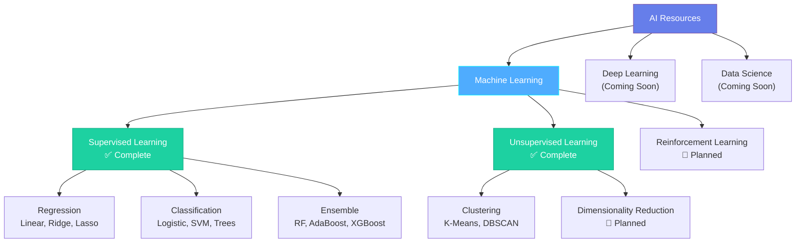

# AI Resources & Notes

This repository contains comprehensive resources, notes, and references for Artificial Intelligence, Machine Learning, and Deep Learning concepts.

---

## 📚 Contents

### 📖 [Machine Learning Comprehensive Guide](ML_NOTES.md)

A complete reference guide covering fundamental concepts, algorithms, and techniques in Machine Learning, Deep Learning, and Data Science.

**Topics Covered:**

#### 🎯 Foundational Concepts
- AI vs ML vs DL vs Data Science
- Types of Machine Learning (Supervised, Unsupervised, Reinforcement)
- Regression vs Classification

#### 🔵 Supervised Learning Algorithms
- **Regression**: Linear Regression, Ridge, Lasso
- **Classification**: Logistic Regression, Naïve Bayes, KNN, SVM
- **Tree-Based**: Decision Trees, Random Forest, AdaBoost, XGBoost
- **Metrics**: R², Adjusted R², Confusion Matrix, Precision, Recall, F1 Score
- **Concepts**: Bias-Variance Tradeoff, Regularization, Gradient Descent

#### 🔴 Unsupervised Learning Algorithms
- **Clustering**: K-Means, Hierarchical Clustering, DBSCAN
- **Validation**: Silhouette Score, Elbow Method

#### 📊 Visual Learning
- 15+ Mermaid diagrams illustrating:
  - Algorithm workflows and decision trees
  - Concept relationships and hierarchies
  - Step-by-step process flows
  - Performance metric calculations
  - Algorithm selection guides

#### 📋 Quick Reference
- Algorithm comparison tables
- When to use each algorithm
- Data preprocessing requirements
- Pros and cons of each method

---

## 🎨 Features

✅ **Comprehensive Coverage** - From basics to advanced ensemble methods  
✅ **Visual Diagrams** - Mermaid flowcharts for better understanding  
✅ **Mathematical Formulas** - Clear explanations with notation  
✅ **Practical Guidance** - Algorithm selection and use cases  
✅ **Quick Reference** - Comparison tables and cheat sheets  

---

## 🚀 Getting Started

1. **Beginners**: Start with [Foundational Concepts](ML_NOTES.md#foundational-concepts)
2. **Intermediate**: Explore [Supervised Learning](ML_NOTES.md#supervised-learning)
3. **Advanced**: Deep dive into [Ensemble Techniques](ML_NOTES.md#ensemble-techniques)
4. **Quick Lookup**: Use the [Algorithm Selection Guide](ML_NOTES.md#algorithm-selection-guide)

---

## 📖 How to Use This Repository

### For Learning
- Follow the notes sequentially for structured learning
- Use diagrams to visualize complex concepts
- Refer to comparison tables for quick reviews

### For Reference
- Jump to specific algorithms using the table of contents
- Check the algorithm selection guide for project decisions
- Review formulas and metrics as needed

### For Interview Preparation
- Study the quick reference tables
- Understand bias-variance tradeoff
- Review performance metrics and their use cases

---

## 🛠️ Topics Breakdown

---

## 📝 Note Structure

Each algorithm section includes:

1. **Concept Overview** - What it is and when to use it
2. **Visual Diagram** - Mermaid flowchart or process diagram
3. **Mathematical Foundation** - Formulas and explanations
4. **Key Components** - Important parameters and hyperparameters
5. **Practical Considerations** - Pros, cons, and best practices

---

## 🎯 Learning Path

### Beginner Path
1. Understand AI/ML/DL differences
2. Learn Linear Regression
3. Grasp Logistic Regression
4. Explore Decision Trees
5. Try K-Means Clustering

### Intermediate Path
1. Master Regularization (Ridge/Lasso)
2. Understand Bias-Variance Tradeoff
3. Learn Ensemble Methods
4. Explore SVM
5. Study Performance Metrics

### Advanced Path
1. Deep dive into XGBoost
2. Understand Kernel Tricks
3. Master Hyperparameter Tuning
4. Learn Cross-Validation
5. Explore Advanced Metrics

---

## 🔗 Resources

### Recommended Tools
- **Python Libraries**: scikit-learn, pandas, numpy, matplotlib
- **Visualization**: seaborn, plotly
- **Advanced ML**: XGBoost, LightGBM, CatBoost
- **Deep Learning**: TensorFlow, PyTorch (coming soon)

### Practice Platforms
- Kaggle - Competitions and datasets
- Google Colab - Free GPU notebooks
- UCI ML Repository - Classic datasets

---

## 📊 Algorithm Comparison

| Category | Algorithms | Difficulty | Use Cases |
|----------|-----------|------------|-----------|
| **Regression** | Linear, Ridge, Lasso | ⭐⭐ | Price prediction, forecasting |
| **Classification** | Logistic, SVM, Trees | ⭐⭐⭐ | Spam detection, diagnosis |
| **Ensemble** | RF, XGBoost | ⭐⭐⭐⭐ | Competitions, complex patterns |
| **Clustering** | K-Means, DBSCAN | ⭐⭐ | Customer segmentation, anomaly detection |

---

## 🤝 Contributing

Contributions are welcome! Feel free to:
- Add new algorithms or concepts
- Improve existing explanations
- Fix errors or typos
- Add practical examples or code snippets
- Enhance diagrams

---

## 📅 Roadmap

- [x] Foundational ML Concepts
- [x] Supervised Learning Algorithms
- [x] Unsupervised Learning (Clustering)
- [ ] Deep Learning Fundamentals
- [ ] Neural Networks Architecture
- [ ] CNN and RNN
- [ ] Natural Language Processing
- [ ] Reinforcement Learning
- [ ] MLOps and Deployment
- [ ] Code Examples and Implementations

---

## 📄 License

This repository is provided for educational purposes.

---

## 🌟 Quick Links

- 📖 [Full ML Notes](ML_NOTES.md)
- 🎯 [Algorithm Selection Guide](ML_NOTES.md#algorithm-selection-guide)
- 📊 [Performance Metrics](ML_NOTES.md#classification-metrics)
- 🌲 [Decision Trees](ML_NOTES.md#decision-trees)
- 🎲 [Ensemble Methods](ML_NOTES.md#ensemble-techniques)
- 🔵 [Clustering](ML_NOTES.md#k-means-clustering)

---

**Last Updated:** November 2025  
**Status:** Active Development 🚀
